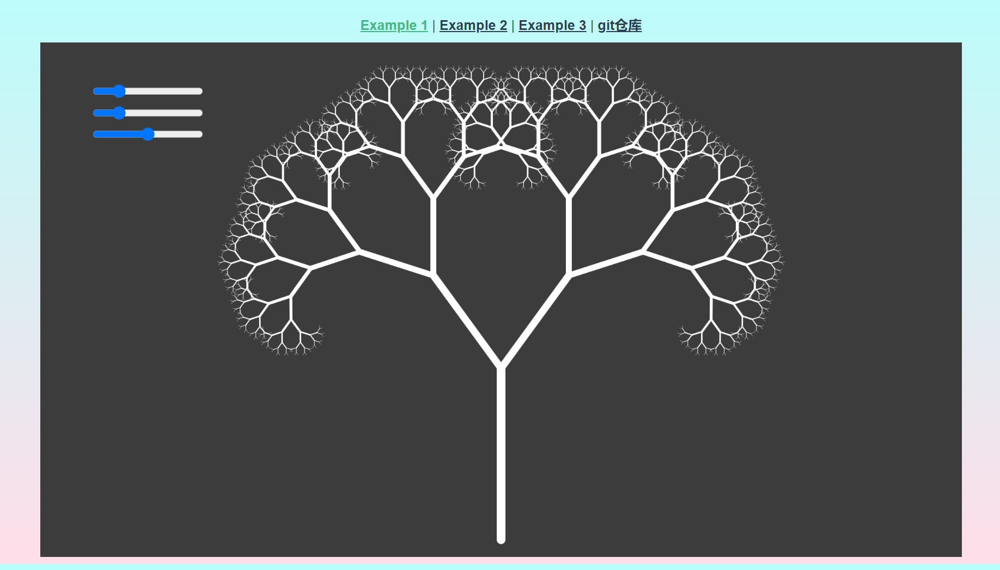
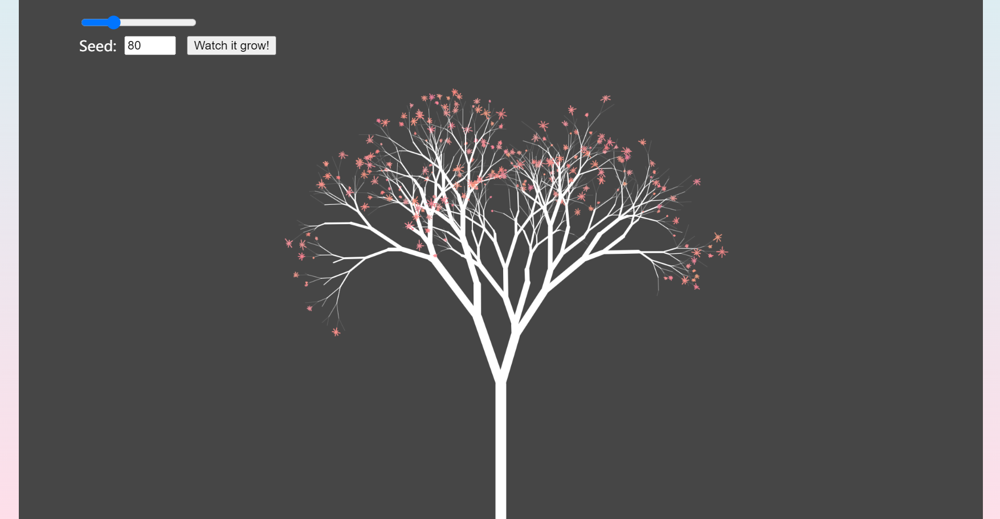

# vue-p5-fractal-tree
基于vue3+p5.js制作，由模板vue-p5-template改编而来

原地址[vue-p5-template](https://github.com/warricktsai/vue-p5-template)



## Project setup
```
npm install
```

### Compiles and hot-reloads for development
```
npm run serve
```

### Compiles and minifies for production
```
npm run build
```
